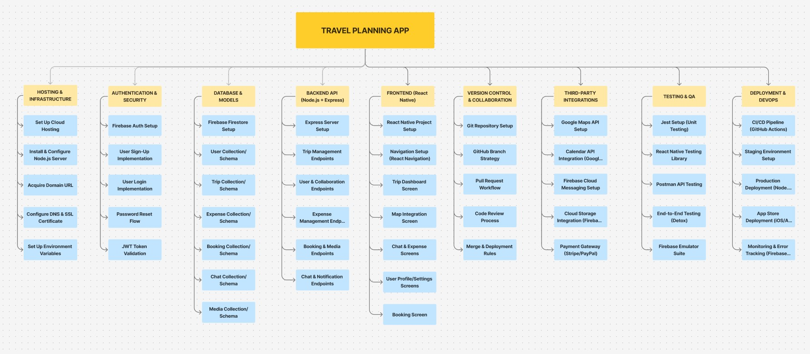
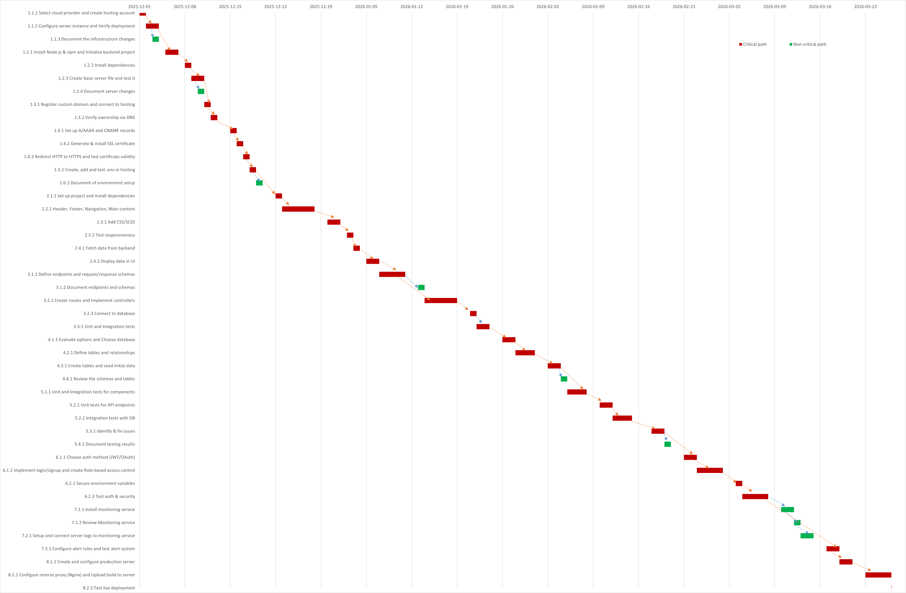
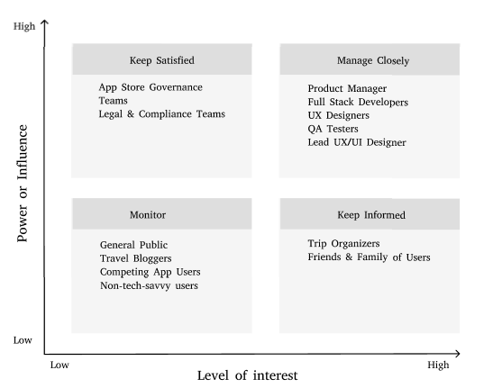

# Project Charter : Mobile-App-for-Planning-Sharing-Trips
# 1. Introduction  
Planning sharing trips can often be chaotic, with important details scattered across multiple apps—chat platforms, maps, booking sites, and spreadsheets. This disorganization leads to miscommunication, missed bookings, budgeting confusion, and overall frustration. To address this, our team is developing a unified mobile solution: Mobile-App-for-Planning-Sharing-Trips, designed to streamline every stage of collaborative trip planning.

# 2. Overview  
## 2.1 Objective  
The key objectives of the Mobile-App-for-Planning-Sharing-Trips are:  
- To allow users to create and manage detailed trip itineraries.
- To support real-time collaboration by inviting friends and assigning planning roles.
- To integrate tools like maps, calendars, and bookings for a seamless travel experience.
- To track and split expenses fairly among group members.
- To offer offline access and media sharing for enhanced usability during trips.
- To provide a personalized, accessible interface for all types of travelers.

# 3. Milestones

- Milestone 1 (itinerary-core-setup) : Basic functionality for trip creation, destination search, inviting friends, and viewing total trip cost.

- Milestone 2 (group-collaboration-module) : Enable shared bookings, group chat, activity voting, and shared expense logging.

- Milestone 3 (notifications-and-group-coordination) : Add push notifications, trip detail change alerts, polling for group decisions, and role assignments.

- Milestone 4 (maps-and-location-services) : Display trip activities on interactive maps, allow pin editing, location-based reminders, and shared map views.

- Milestone 5 (calendar-and-booking-integration) : Sync trip calendar, filter/book activities, duplicate past trips, and enable offline calendar access.

- Milestone 6 (expense-history-and-budgeting) : View past trip expenses, get cost/time estimates, attach receipts, and receive budget-friendly suggestions.

- Milestone 7 (media-and-offline-access) : Upload/share photos, mark favorite activities, download trip PDFs, and set trip privacy.

- Milestone 8 (user-preferences-and-accessibility) : Enable customizable itinerary views, personalized activity recommendations, multilingual support, and accessibility features such as larger text and voice commands.

## 3.1 Work Breakdown Structure

## 3.2 Requirements Traceability Matrix

| Req ID | Requirement                         | Del ID | Deliverable                                                                 | Owner   | Status       |
|-------:|-------------------------------------|:------:|------------------------------------------------------------------------------|---------|--------------|
| REQ01  | Cloud Hosting & Server Setup        | DEL01  | Hosting environment running with domain, DNS & SSL configured                | DevOps  | Done         |
| REQ02  | Authentication & Security Setup     | DEL02  | Secure user authentication and authorization implemented (Firebase/Auth0)    | Backend | Testing      |
| REQ03  | Database Configuration              | DEL03  | Database (Firestore/MongoDB) with user, trip, expense & booking schemas      | Backend | Testing      |
| REQ04  | Backend API Endpoints               | DEL04  | Node.js + Express backend with trip, expense, and booking APIs               | Backend | Pending      |
| REQ05  | React Native Frontend Setup         | DEL05  | Mobile app with navigation, trip dashboard & map integration                 | Frontend| Pending      |
| REQ06  | Version Control & Collaboration     | DEL06  | GitHub repo with branch strategy, PR workflow & review process               | DevOps  | Done         |
| REQ07  | Third-Party Integrations            | DEL07  | Integrated Google Maps, Calendar, Firebase Cloud Messaging, Stripe/PayPal    | Backend | Pending      |
| REQ08  | Real-Time Features                  | DEL08  | Chat, live expense updates & push notifications via Firebase/WebSocket       | Backend | Pending      |
| REQ09  | Testing & QA Setup                  | DEL09  | Unit, API & E2E testing environments (Jest, Detox, Postman)                  | QA      | In Progress  |
| REQ10  | Deployment & Monitoring             | DEL10  | CI/CD pipeline, staging & production deployment, Crashlytics monitoring      | DevOps  | Pending      |

# 4. Deliverables

## 4.1 Trip Itinerary Management
- Create, edit, and delete trips with details such as name, dates, and destinations.  
- Destination search integrated with **Google Maps API** for accurate location selection.  

## 4.2 Collaborative Features
- Invite users to trips and enable real-time group collaboration.  
- Built-in group chat for seamless communication.  
- Assign custom roles (Planner, Driver, Treasurer).  
- Use polls for group decision-making and activity voting.  

## 4.3 Notifications and Updates
- Receive **push notifications** for trip changes, activity updates, and new polls.  
- Get **real-time alerts** for itinerary modifications and group coordination.  

## 4.4 Expense Tracking
- Add and view all trip expenses with contributor details.  
- Track individual contributions and ensure a **fair split** among members.  
- Display real-time **cost summaries** and support expense settlements.  

## 4.5 Map and Location Tools
- Access shared **interactive maps** for trip destinations and activities.  
- Pin activities and view member locations in real time.  
- Set **location-based reminders** for key trip events.  

## 4.6 Booking and Calendar Integration
- Sync itineraries with user calendars (Google Calendar, iCal, etc.).  
- Add notes or reminders for planned events.  
- Filter and book **categorized activities** directly from the app.  

## 4.7 Offline Access and Media Sharing
- View itinerary and essential trip details **offline**.  
- Access synced bookings and calendar events without internet.  
- Upload and share **photos, videos, and documents** within the group.  

## 4.8 Personalization & Accessibility
- Switch between **custom views** (list or grid).  
- Enable larger text sizes and voice commands for accessibility.  
- Support multiple **language preferences** and personalized activity suggestions.

# 5. Preliminary Budget 

# Project Budget

| **Cost Category** | **Description** | **Unit Cost** | **Quantity** | **Total Cost (CAD)** |
|--------------------|-----------------|----------------|---------------|----------------------|
| **Personnel Costs** | Full Stack Developers (4 developers, 15 weeks) | $40/hr | 4 × 600 hrs | **$96,000** |
| **Fixed Costs** | Cloud Hosting (Firebase / Backend) | Monthly | 4 months | $400 |
|  | Third-party APIs (Google Maps, Calendar) | Monthly | 4 months | $200 |
|  | Design Tools (Figma, Adobe XD) | License | 1 | $50 |
| **Contingency Costs** | Miscellaneous / unexpected expenses (~10%) | — | — | **$9,665** |
| **Total Estimated Budget** | — | — | — | **$106,315 CAD** |

# 6. Organization and Stakeholders, 
## 6.1 Stakeholder Analysis Matrix 

## 6.2 Communications Plan

| Information                          | Owner                          | Audience                                              | Schedule / Ceremony              | Channel                          |
|--------------------------------------|--------------------------------|-------------------------------------------------------|----------------------------------|----------------------------------|
| Sprint Goals & Backlog Grooming      | Product Owner                  | Scrum Team (Developers, QA, UX, Scrum Master)         | Before each Sprint               | Miro / Jira + Zoom               |
| Sprint Planning                      | Scrum Master + Product Owner   | Entire Scrum Team                                     | Start of each Sprint (2 weeks)   | Zoom + Jira                      |
| Daily Scrum (Stand-up)               | Scrum Master                   | Entire Scrum Team                                     | Daily (15 min)                   | Slack Huddle / Zoom              |
| Feature Rollout / Technical Design   | Lead Engineer                  | Developers, QA Testers, Scrum Master                  | Weekly                           | Slack + GitHub + Confluence      |
| Sprint Review (Demo)                 | Product Owner + Scrum Team     | Investors, Partners, End Users (optional)             | End of each Sprint               | Zoom + Live demo                 |
| Sprint Retrospective                | Scrum Master                   | Entire Scrum Team                                     | End of each Sprint               | Miro + Zoom                      |
| Privacy & Compliance Log             | Legal Team                     | App Store Governance, Compliance Teams, Scrum Master  | Monthly                          | Secure Portal                    |
| Itinerary Sync Feature Updates       | UX Designer                    | Trip Organizers, End Users                            | Biweekly                         | In-App Notification + Release Notes |
| Bug Fix Summary & Sprint Burndown    | QA Tester + Scrum Master       | Lead Developers, Lead Engineer, Product Owner         | Weekly + End of Sprint           | Jira Dashboard + Slack           |
| Design Feedback Loop                 | Lead UX/UI Designer            | End Users, Trip Organizers, Product Owner             | Monthly                          | Survey + Figma Comments          |
| Impediment & Blocker Escalation      | Scrum Master                   | Product Owner, Lead Engineer, Stakeholders (as needed)| As they occur (within 24 h)      | Slack (#blockers) + 1:1 calls    |
| Team Velocity & Sprint Metrics       | Scrum Master                   | Product Owner, Project Sponsor, Lead Engineer         | End of each Sprint               | Jira Reports + Email             |

# 7. Risks, Assumptions, and Constraints 
## 7.1 Identified Project Risks

## High Impact & Likely
1. **Third-Party API Failures**  
   (Google Maps, Google Calendar, Firebase Messaging outages may disrupt essential features.)

## Low Impact & Likely
2. **Feature Delivery Delays**  
   (Sprint items may slip due to dependencies, lack of QA coverage, or team workload.)

## High Impact & Unlikely
3. **Data Breach or Authentication Failure**  
   (Potential vulnerabilities in Firebase/Auth0 or exposed JWT tokens could compromise user data.)

4. **App Store Rejection**  
   (Violations of Google/Apple store policies, incomplete documentation, or privacy non-compliance.)

## Low Impact & Unlikely
5. **Low User Adoption**  
   (Users may find the app too complex or may prefer existing planning tools.)

6. **Budget Overruns**  
   (Unexpected costs from API quotas, hosting usage, licenses, or tools.)

