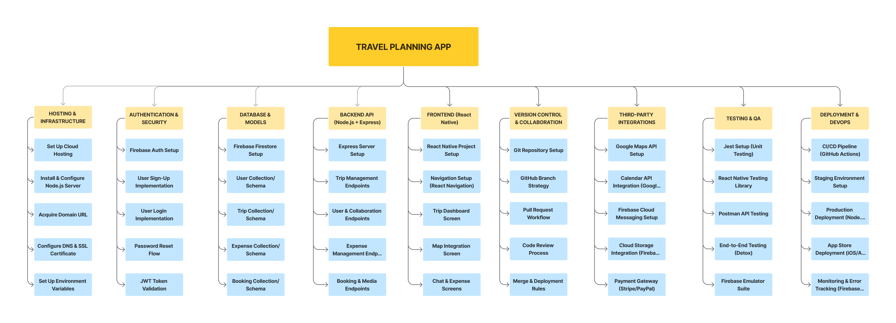

# Project Charter : Mobile-App-for-Planning-Sharing-Trips
# 1. Introduction  
Planning sharing trips can often be chaotic, with important details scattered across multiple apps—chat platforms, maps, booking sites, and spreadsheets. This disorganization leads to miscommunication, missed bookings, budgeting confusion, and overall frustration. To address this, our team is developing a unified mobile solution: Mobile-App-for-Planning-Sharing-Trips, designed to streamline every stage of collaborative trip planning.

# 2. Overview  
2.1 Objective  
The key objectives of the Mobile-App-for-Planning-Sharing-Trips are:  
- To allow users to create and manage detailed trip itineraries.
- To support real-time collaboration by inviting friends and assigning planning roles.
- To integrate tools like maps, calendars, and bookings for a seamless travel experience.
- To track and split expenses fairly among group members.
- To offer offline access and media sharing for enhanced usability during trips.
- To provide a personalized, accessible interface for all types of travelers.

# 3. Milestones

- Milestone 1 (itinerary-core-setup) : Basic functionality for trip creation, destination search, inviting friends, and viewing total trip cost.

- Milestone 2 (group-collaboration-module) : Enable shared bookings, group chat, activity voting, and shared expense logging.

- Milestone 3 (notifications-and-group-coordination) : Add push notifications, trip detail change alerts, polling for group decisions, and role assignments.

- Milestone 4 (maps-and-location-services) : Display trip activities on interactive maps, allow pin editing, location-based reminders, and shared map views.

- Milestone 5 (calendar-and-booking-integration) : Sync trip calendar, filter/book activities, duplicate past trips, and enable offline calendar access.

- Milestone 6 (expense-history-and-budgeting) : View past trip expenses, get cost/time estimates, attach receipts, and receive budget-friendly suggestions.

- Milestone 7 (media-and-offline-access) : Upload/share photos, mark favorite activities, download trip PDFs, and set trip privacy.

- Milestone 8 (user-preferences-and-accessibility) : Enable customizable itinerary views, personalized activity recommendations, multilingual support, and accessibility features such as larger text and voice commands.

## 3.1 Work Breakdown Structure

